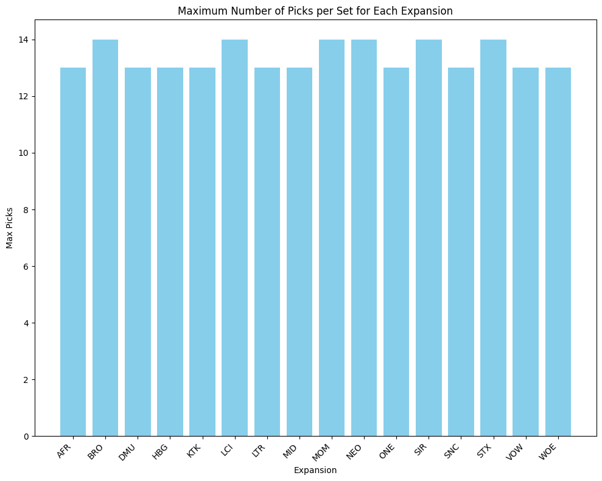
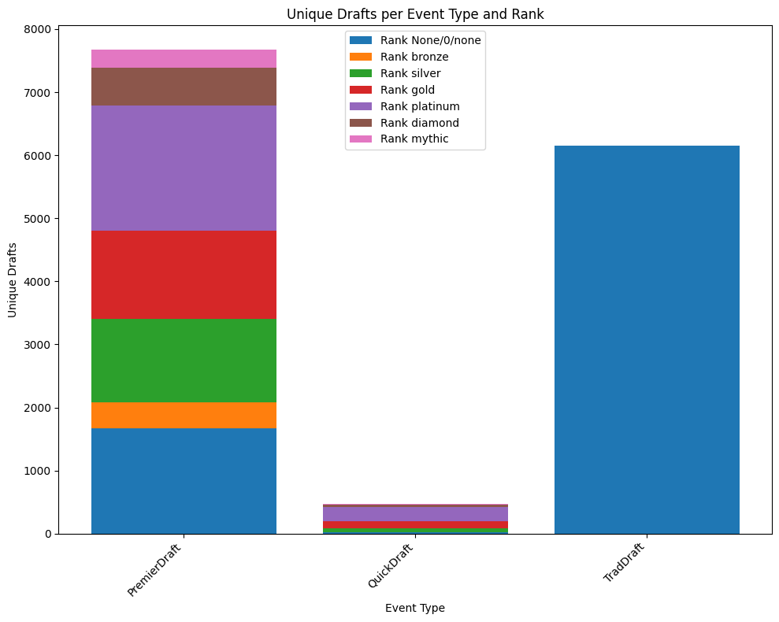
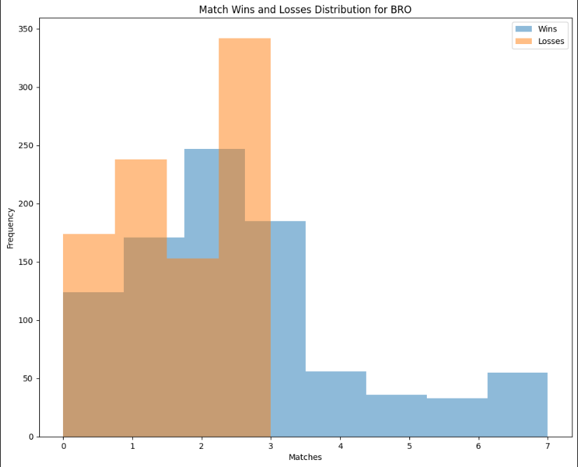

# Predicting Wheeling in MTG Drafts with Random Forests

## Overview
This project investigates the factors influencing card selection strategies and outcomes in Magic: The Gathering (MTG) drafts. Utilizing a comprehensive dataset from 17lands, an MTG draft tracker, we explore the impact of draft type, player rank, and the sequence of card selections on the probability of cards returning to the drafter in subsequent rounds. Through extensive data cleaning, exploratory analysis, and machine learning modeling, we uncover insights into optimal drafting strategies and the dynamics of the draft process. Our findings contribute to a deeper understanding of strategic decision-making in MTG and offer practical implications for players and game designers alike.

The dataset consists of over one million unique drafts across multiple MTG sets. For each draft, detailed information is provided including the cards available in each pack, the card selected by the player, relevant player stats, and the draft outcome. This rich data enables a thorough examination of the complex interplay between player skill, card evaluation, signaling, and probability that shapes the draft experience.

> **Note**: Due to size constraints, the dataset and trained models are not included in this repository.

## Project Motivation
Magic: The Gathering drafts present players with a complex strategic challenge, requiring not only a deep understanding of the card pool but also the ability to read signals and anticipate opponents' decisions. Skilled players often cite the ability to identify open colors, read signals, and navigate the draft based on the flow of packs as key factors in their success. However, there is currently limited empirical research quantifying the impact of these skills and how they interact with the structure of the draft itself. This project seeks to address this gap by leveraging the extensive data collected by 17lands to uncover the key determinants of desirable outcomes like wheeling powerful cards.

## Project Aims
- Quantify the influence of player rank on card selection patterns and outcomes
- Investigate how the sequence of picks within a pack affects the probability of wheeling
- Compare card wheeling rates across different types of drafts (e.g., Premier vs. Quick)
- Develop predictive models to estimate the likelihood of a card wheeling based on observable features
- Generate actionable insights for both players looking to improve their draft strategies and game designers aiming to create engaging limited environments

## Dataset Description
The dataset comprises over 20,000 unique draft events recorded by 17lands, spanning multiple MTG sets. For each draft, the data includes:
- Anonymized player ID and rank
- Draft type (e.g., Premier, Quick)
- Set name
- Pack number and pick number for each selection
- Contents of each pack
- Card selected by the player
- Outcome of the draft (e.g., number of match wins)

## Methods

### Data Cleaning and Preprocessing
- Removal of rows with missing or inconsistent information
- Standardization of rank categories
- Transformation of pack contents and pick information into binary indicator variables
- Storage in SQLite database for efficient querying

### Key Visualizations

#### Picks per Expansion
The model demonstrated robustness across various sets, handling different pack sizes (13-14 picks):

#### Draft Types by Rank
Analysis revealed significant disparities between draft types and ranks, leading to an imbalanced dataset (mitigated by Random Forest characteristics):

#### Match Win Distribution
Due to Arena MTG's 3-loss elimination format, the distribution shows irregular patterns:

### Predictive Modeling
- Binary classification approach for predicting card wheeling probability
- Random Forest classifier as the final selected model
- Model evaluation using accuracy, precision, recall, and F1 score
- Assessment of generalizability across player ranks and sets

## Results
The model achieved promising performance metrics:
- Accuracy: 86.46%
- Precision: 90.70%
- Recall: 77.12%
- F1-score: 83.37%

Note: Results might have been affected by using a smaller percentage of data per set to manage computational costs. Increased data volume would likely improve performance.

## Limitations and Future Work
### Current Limitations
- Dataset covers only a subset of MTG sets
- Model focuses primarily on card wheeling likelihood
- Treats picks independently, not accounting for draft interdependencies
- Uses card names only due to computing power constraints

### Future Directions
- Incorporate additional data sources
- Refine feature engineering
- Explore advanced modeling techniques
- Fine-tune LLM for better holistic draft understanding
- Include qualitative analysis through player interviews/surveys
